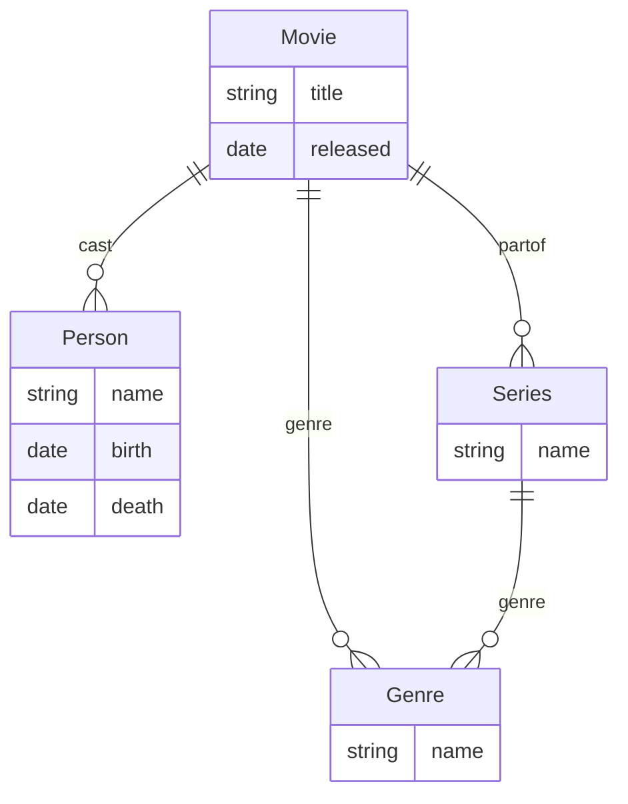

## Historical context 

In 2019, the W3C held a workshop called "Web Standardization for Graph Data" [@w3c2019] with
the intent of bringing together various parties standardizing different
aspects of graph data on and off the Web. Later that year, ISO established GQL as an official
ISO project to be accomplished by ISO/IEC JTC 1/SC 32 [@gql2019] which is the same group that 
publishes and maintains the SQL query language. While the attempt at unification may
have not quite succeeded, the need and want to address standardization of database query languages
for graphs had already been well established.

Graphs have long been used in mathematics and computer science. Alongside, database systems have 
evolved for storing graph data (e.g., some as early as 1973, see IDMS [@idms]). Many of these
earlier systems used traversal as a mechanism for retrieving information. That is, instead
of a query that specifies properties, information is retrieved by using a starting node in
the graph and traversing relationships. Some more modern systems have proprietary query languages
and others have both traversal and query capabilities.

A graph database [@graphdb] has the distinguishing characteristic that
it uses graph structures to store information where conceptually we have:

 * nodes that represent entities,
 * edges that are relationships between entities,
 * and information is associated with nodes and edges in the graph.

From 2019 through to the present, the participants of ISO/IEC JTC 1/SC 32 have been
working on standardizing a query language for graphs that is specifically focused on
the property graph model where nodes and edges may have labels and property sets. Regardless
of the motivation to use property graphs, a network model with node and edge attributes 
is very common and valuable to data practitioners. As such, it is a very good place to 
consider standardization and the result was the ISO/IEC 39075:2024 GQL standard [@GQL2024].

## Property graphs

A property graph [@propertygraph] is a graph G(N,E) with specific properties that
can be informally described as:

 * N is a set of nodes
 * E is a set of edges associated with two nodes of G
 * Every node may have a set of label names
 * Every edge may have a set of label names
 * Nodes and edges may have a property set that is a mapping from name to value

with the additional constraints:

 * An edge may be a self loop with the same node used in the association
 * If an edge is directed, one node must be the source and one node must be the destination.
 * Label names may not repeat for a specific node or edge; they may repeat across nodes and edges.
 * A property set is a mapping of a unique name to a unique value. That is, there is a single value for a unique name for a specific node or edge.

A good way to conceptualize a property graph is with an Entity-Relationship Model [@erm]. For example, a very simple
graph of movies, cast members, and genres might start with a diagram like:



In the above ERM model, properties have been only associated on the Person, Movie, Genre, and Series entities. In the full ERM model, 
we can add properties to relationships as well. Also, in the ERM model, the type of the entity or relationship is a label in 
the property graph model. The only real difference with property graphs is that the label is just a set of names that 
does not necessarily imply a type or requirement for certain properties. Finally, you may also have multiple labels 
for nodes and edges (i.e., entities and relations in ERM).

GQL only consider property graphs as the underlying graph model. All queries, types, schemas, and results are built from
queries surrounding property graphs alone. While you may be able to map other graph models into a property graph, the GQL
language itself has no additional support for doing so.

## What does a GQL query look like?

GQL shares a syntactic heritage with the openCypher query language [@opencypher] where the central concept is
the match pattern that describes a node or path in the graph. Within the query, identifiers can be bound to
various aspects (e.g., a node, edge, or path) and results can be computed. A result is typically a table
of data that may consist of simple values (e.g. a string or number) or complex objects like a node, edge,
or path.

What transpires between and client requested a query execution and the database engine returning the
resulting data return is generally implementation defined. At a more abstract layer, results are
returned via the binding table as part of the GQL agent's execution outcome. While the way return values 
are transported is not part of the scope of the standard, it is easy to conceptualize this result
as a table of data, as the name implies, but where the columns may be complex GQL objects such
as nodes or edges.

While a simplification of the grammar, a query generally consists of a "primitive query statements" (§14.3 [@GQL2024]) 
that are joined together much like a "pipeline" where the results of the previous statement are modified by
the application of the next statement. At the end of this pipeline is often a return statement that formulates
a result. Without the return statement, the response may be empty.

At the center of many expressions is a "graph pattern" (§16.3 [@GQL2024]) that describes a set of "path patterns"
that can be used to identify portions of the graph. These patterns are used by the containing statement to
modify the target nodes and edges and, ultimately, change the binding table that affects the query outcome. Patterns
affect the binding table by assigning variables to portions of an expression (i.e., paths, nodes, or edges).

While it should be noted that there is some shorthand expressions in the grammar, a path pattern can express:

 * a node: `(:Movie)`
 * an edge: `-[:cast]->`
 * a path: `(:Movie)-[:cast]->(:Person)`

From these building blocks, more complicated expressions can be built. In the abbreviated syntax shown
in the above examples, a label name is prefixed with a colon and qualifies to the kind of node or edge that
matches. The edge expression has various syntactic elements that indicate direction in addition to the label:

 * `-[:cast]->` edge pointing right
 * `<-[:cast]-` edge pointing left
 * `~[:cast]~` undirected
 * `~[:cast]~>` undirected or edge pointing right
 * `<~[:cast]~` undirected or edge pointing left
 * `<-[:cast]->` any edge direction
 * `-[:cast]-` any edge

These can also be shortened to remove the label for the edge (e.g., `->`, `<-`, `~`, `~>`, `<~`, `<->`, `-`, respectively).

Using the graph of movies described in the previous section, consider a simple expression using a 
"match statement" (§14.4 [@GQL2024]) to find the cast of a popular movie:

```
MATCH (:Movie {title: 'Star Wars: A New Hope'})-[:cast]->(a:Person)
RETURN a.name, a.birth, a.death
```

The query matches a specific movie by title where the title property of a `Movie` labled node
must match "Star Wars: A New Hope". The pattern follows a directed edge that must
be labeled `cast` to a node that must be labeled `Person`.  In the expression `(a:Person)`,
a variable `a` is bound to the matching nodes. The effect of the statement is the 
binding table is modified to include a column with a field name of `a` whose values are
the matching `Person` labeled nodes.

The following statement starting with the `RETURN` keyword is a "primary return statement"
(§14.19 [@GQL2024]) that contains a "return statement" (§14.11 [@GQL2024]) that
modifies the binding table to include three columns named "name", "birth", and "death". This
binding table is the working table outcome for the return statement is use as the
execution outcome's result.

A path pattern can also represent more complex relationships. For example, the
co-stars for particular individual might be retrieved as:

```
MATCH DIFFERENT EDGES 
  (:Person {name:'Mark Hamill'})-[c1:cast]-(m:Movie)
    -[c2:cast]-(a:Person)
RETURN a.name
```

Where the `DIFFERENT EDGES` ensures that the edge `c1` and `c2` are different to ensure that
"Mark Hamill" is not amongst the co-stars.

## A brief tour of statements

There are five "primitive query statements" (match, filter, let, for, order by/pagination) 
and the "select statement" (§14.3 [@GQL2024]) that form the basis of linear query statement 
without considering the additional complexity of focus and nesting queries. The select 
statement is a single statement whereas the remaining five primitive query statements can 
be chained together for a combined effect.

In the prior section, the "match statement" was introduced. This statement can be used in
combination with other statements to produce a specific result. For example, the binding
table can be filtered with a "filter statement" (§14.6 [@GQL2024]) where we want to
list cast who were in more than one movie of a series:

```
MATCH (a:Person)<-[:cast]-(m:Movie)
        -[:partof]->(:Series {name:'Star Wars'})
FILTER WHERE count(m) > 1
RETURN a.name
```

The let statement allows us to bind variables to be used in queries:

```
MATCH (c:Person {name:'Mark Hamill'})
         <-[c1:cast]-(m:Movie)->(:Series {name:'Star Wars'})
LET numberOfMovies = count(m)
MATCH (a:Person)<-[:cast]-(om:Movie)
        -[:partof]->(:Series {name:'Star Wars'})
FILTER WHERE count(om) > numberOfMovies
RETURN a.name
```

The for statement allows us to remove nesting. For example, we may
simplify processing by returning the movie title along with the series genre 
as a single row of pairs of names:

```
MATCH (m:Movie)->(s:Series {name:'Star Wars'})
OPTIONAL MATCH (s)-[:genre]-(g)
FOR name IN g
RETURN m.title, name
```

Finally, we can order and limit results:

```
MATCH (a:Person)<-[:cast]-(m:Movie)
        -[:partof]->(:Series {name:'Star Wars'})
ORDER BY a.name ASCENDING
LIMIT 100
RETURN a.name
```

In contrast, the select statement is an example of a syntactic transformation
in GQL. While there is some complexity in the transformation, the general
form is the fields are selected from a matching graph query and the 
criteria and results are specified by direct syntactic transformations into
other statements. 

For example, consider the following select statement:

```
SELECT a.name,m.title
FROM CURRENT_GRAPH
  MATCH DIFFERENT EDGES 
    (:Person {name:'Mark Hamill'})<-[c1:cast]-(:Movie)
      -[c2:cast]->(a:Person)<-[c3:cast]-(m:Movie)
WHERE 
  NOT EXISTS { MATCH (m)-[:partof]->(:Series {name:'Star Wars'}) }
```

This select statement transforms into a query scoped by an "inline procedure call" (§15.2 [@GQL2024]) that is followed
by a filter statement and a primitive result statement. While the user of GQL does not need
to be concerned with such transformation, there are many of these syntactic transformations that an
implementor needs to be able to carefully construct.

```
CALL () {
  USE CURRENT_GRAPH
  MATCH DIFFERENT EDGES 
    (:Person {name:'Mark Hamill'})<-[c1:cast]-(:Movie)
      -[c2:cast]->(a:Person)<-[c3:cast]-(m:Movie)
  RETURN c1 AS c1, c2 AS c2, c3 AS c3, a AS a, m AS m
}
FILTER WHERE 
  NOT EXISTS { MATCH (m)-[:partof]->(:Series {name:'Star Wars'}) }
RETURN a.name, m.title
```

## CRUD in GQL

Like most database query languages, GQL has statements for inserting
nodes and edges, setting properties and labels, removing properties
and labels, and deleting nodes and edges. An insert statement
is a simple enumeration of graph patterns where variables can
be assigned to elements of prior patterns for use in subsequent
patterns.

For example, the insert statement (§13.2 [@GQL2024]) can be used to
add a movie and cast member into the graph. The following
example results in a new `Movie` node, and edge labeled `partof`
between that movie node and a new `Series` node, and a new
`Person` node with a `cast` labeled edge pointing to it from 
the movie node:

```
INSERT 
(m:Movie {
   title: 'Star Wars: Episode IV - A New Hope', 
   released: '1977-05-25'}),
(m)-[:partof]->(:Series {name:'Star Wars'}),
(:Person {name:'Mark Hamill', birth: '1951-09-25'})<-[:cast]-(m)
```

A more nuanced insertion might use the result of a query to perform
the insertion where only the new `Person` node and `cast` labeled edge are created:

```
MATCH (m:Movie {title: 'Star Wars: Episode IV - A New Hope'})
        -[:partof]->(:Series {name:'Star Wars'})
INSERT (:Person {
          name:'Mark Hamill', 
          birth: '1951-09-25'
        })<-[:cast]-(m)
```

A matched node or edge can have properties and labels set by a set statement (§13.3 [@GQL2024]). For
example, the `birth` property can be set on a matched `Person` labeled node:

```
MATCH (p:Person {name:'Mark Hamill'})
SET p.birth = '1951-09-25'
```

Similarly, a remove statement (§13.4 [@GQL2024]) can be used to remove properties or labels. For
example, we can ensure a matching `Person` node does not have a `death` property:
```
MATCH (p:Person {name:'Mark Hamill'})
REMOVE p.death
```

Finally, the delete statement (§13.5 [@GQL2024]) can be used to remove nodes and
edges from the graph entirely. For example, we can ensure a particular person is not
a cast member by matching the `Person` node and using the delete statement on the 
bound variable:

```
MATCH (:Person (name: 'Kevin Bacon'))<-[c:cast]-(:Movie)-[:partof]->(:Series {name:'Star Wars'})
DELETE c
```

Curiously, there is no counterpart to the `MERGE` statement from openCypher. The MERGE statement
allowed node and edges to be optionally matched by property values. If present, the existing nodes
and edges would be used to construct the missing graph patterns. Without the semantics of this
kind of statements, a client application must test for the existence of various nodes and edges
to perform updates; a possibly expensive operation to do outside the database engine.

## Possible applications

The obvious candidates for adoption are current databases that implement property graphs
and the openCypher query language. These products are positioned close enough that a
simple syntax transformation may support simple GQL queries. While a more complicated
transformation layer may be able to be layered without much effort.

A "complete" GQL implementation may be farther afield. This particularly depends on
the features of the query language required by certain applications. There are 228 optional 
features in the GQL standard. Whereas, particular application areas may require a common 
subset of these to be implemented for successful use.

In the near term, it is fair to assume that areas of applications will be the 
same areas currently addressed by property graph database technologies. Longer term,
you may see an expansion of possibilities as relational databases add graph query capabilities
(e.g., Apache AGE for Postgres [@age]). Such things may bridge the gap for scaling
database deployments.

GQL is unlikely to change the scope of applications where openCypher has currently
been used to access property graph databases. Instead, it just helps legitimize the
offering of these database engines by giving them a standardized query language. By
doing so, developer and user tools can be separated from database engines and this
may help adoption.

## Conclusions

As a new standard, it remains to be seen what the pace and breadth of adoption will be as
database vendors and users contemplate graph databases. There are a core set of likely
vendors who are already using openCypher where the conversion to GQL as an alternate
syntax is probably. Whether there are conformance levels that match the subsets of GQL
that are useful to them is worth further research.

The GQL standard contains a variety of alternative syntaxes. For reasons not stated
in the standard itself, there are keyword synonyms like "NODE" versus "VERTEX", 
"EDGE" vs "RELATION", etc. that seem superfluous and likely to lead to user
confusion or interoperability issues. Similarly, there are various keywords 
that are simply optional without affecting the outcome (e.g., "PROPERTY GRAPH" vs
"GRAPH") and that seems also unneeded.

The standard itself is devoid of examples. It is not intended to be a primer. Yet, the
semantics described in the "General Rules" of various statements feel under specified
at times. The combination of these two will likely lead to the need for clarifications
or revisions from the editors.

Within GQL there is also a schema language for describing graphs nodes, edges, and
their labels and properties. While a good start at describing graph structures, it
will need more abilities in future revisions. It should be viewed as a schema language 
for "leaf types" that can be used by the database engine for optimizations and 
basic type checking.

These concerns and opinions lead to one general observations: there will be revisions to 
the GQL standard. This revision will contain, at least, corrections or clarifications. It
is unlikely to expand the scope of an implementor's burden without sufficient justification.
Meanwhile, let's welcome the new kid on the block and see what they can do.

## References

---
link-citations: true
references:
 - id: GQL2024
   title: "ISO/IEC 39075:2024 Information technology - Database languages - GQL"
   type: techreport
   issued:
      year: 2024
      month: 4
   
 - id: w3c2019
   type: event
   title: "W3C Workshop on Web Standardization for Graph Data - Creating Bridges: RDF, Property Graph and SQL"
   url: https://www.w3.org/Data/events/data-ws-2019/
   issued:
      year: 2019
      month: 3
      day: 6
 - id: gql2019
   type: webpage
   title: Critical milestone for ISO graph query standard GQL
   url: https://www.gqlstandards.org/gql-blogs/critical-milestone-for-iso-graph-query-standard-gql
 - id: idms
   type: article-journal
   author: Andrew L. Russell
   issued:
     year: 2011
     day: 9
     month: 4
   title: "Oral-History: Charles Bachman"
   container-title: IEEE Oral History Network
 - id: graphdb
   title: Graph Database
   type: webpage
   url: https://en.wikipedia.org/wiki/Graph_database 
 - id: propertygraph
   title: Property graphs
   type: webpage
   url: https://en.wikipedia.org/wiki/Property_graphs
 - id: erm
   type: article-journal
   author: Peter Pin-Shan Chen
   title: The Entity-Relationship Model -- Toward a Unified View of Data
   container-title: ACM Transactions on Database Systems
   issued:
     year: 1976
   volume: 1
   number: 1 
 - id: opencypher
   author: "Marton, J., Szárnyas, G., Varró, D."
   issued:
     year: 2017
   volume: 10509
   title: Formalising openCypher Graph Queries in Relational Algebra
   container-title: Advances in Databases and Information Systems
   doi: https://doi.org/10.1007/
 - id: age
   type: webpage
   title: "Apache AGE : Graph Database for Postgres SQL"
   url: https://age.apache.org
---
