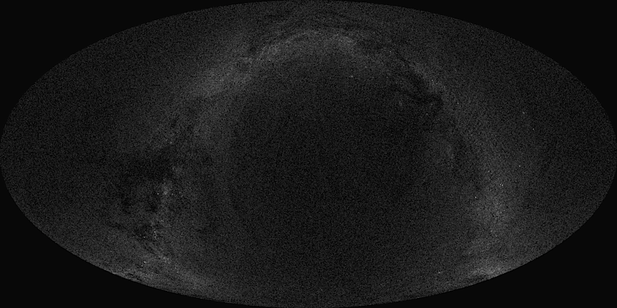

title: Astroinformatics on the Web
author: Alex Miłowski
published: 2014-05-23T23:23:03.29Z
updated: 2014-05-23T23:23:03.29Z
keywords:
- phd
- science
- PAN
- web
- opendata
- Edinburgh
artifacts:
- kind: image/png
  location: act-alpha-mollweide-12-adjusted.png
- kind: image/png
  location: ivoa-votable-usage.png
- kind: image/svg
  location: vo-cone.svg
content: |
   # Astroinformatics on the Web

   This is the second entry in my series on my PhD dissertation titled <cite>Enabling Scientific Data on the Web</cite>.  In this entry, we will explore how astronomers use the Web to share data, some of standards and technologies they have developed, and bit about the history of their development.

   ### Using Astronomical Data on the Web

   At the core of many of the services developed by the [International Virtual Observatory Alliance (IVOA) ]() are REST-oriented services, like [<cite>Simple Cone Search,</cite>]() that return tabular data in an XML format called [VOTable]() .  The service is invoked by a HTTP GET request on a service base URI with a few query parameters attached.  These query parameters define a  “search cone” by the RA and DEC parameters (right ascension and declination) and a SR parameter (radius).  All of these parameters are in decimal degrees.


   <figure><figcaption>Cone Search Parameters</figcaption></figure>

   For example, the US Navy provides a number of star catalogs as IVOA Cone Search services. The ACT catalog contains about one billion stars. The endpoint for the service is the URI  `http://www.nofs.navy.mil/cgi-bin/vo_cone.cgi?CAT=ACT` and the parameters RA, DEC, and SR can be appended to retrieve specific data about stars contained with the corresponding cone (e.g., [`http://www.nofs.navy.mil/cgi-bin/vo_cone.cgi?CAT=ACT&SR=0.25&RA=0&DEC=0` ](http://www.nofs.navy.mil/cgi-bin/vo_cone.cgi?CAT=ACT&VERB=1&SR=0.25&RA=0&DEC=0)  for a cone of radius 0.25° centered at [0°,0°]). The result is an XML document in the VOTable vocabulary as shown below (shorten a bit to fit on this page):

   ```
   <VOTABLE version="1.0">
    <DESCRIPTION>
     United States Naval Observatory Flagstaff Station       23May2014-15:47:20
     Astronomical Image and Catalogue Server:
               http://www.nofs.navy.mil/data/fchpix/
     Please send questions and problem reports to:
               sel@nofs.navy.mil

    </DESCRIPTION>
    <DEFINITIONS>
     <COOSYS ID="eq_FK5" equinox="2000.00" epoch="2000.00" system="eq_FK5"/>
     <DESCRIPTION>Coordinate system is FK5 equinox=J2000.0, epoch=2000.0</DESCRIPTION>
    </DEFINITIONS>
    <RESOURCE name="ACT" type="results">
     <PARAM ID="ipFIELD" datatype="char" name="Field Name" value="NoName" arraysize="*"/>
     <PARAM ID="ipCAT_ID" datatype="char" name="Catalogue ID" value="ACT" arraysize="*"/>
     <PARAM ID="ipNOBJECTS" datatype="int" name="Number of Objects In File" value="5"/>
     <PARAM ID="ipEQUINOX" unit="yr" datatype="double" precision="2" name="Equinox" value="2000.00"/>
     <PARAM ID="ipEPOCH" unit="yr" datatype="double" precision="2" name="Epoch" value="2000.00"/>
     <PARAM ID="ipRA" unit="deg" datatype="double" precision="6" name="Center RA" value="0.000000"/>
     <PARAM ID="ipDEC" unit="deg" datatype="double" precision="6" name="Center DEC" value="0.000000"/>
     <PARAM ID="ipRADIUS" unit="deg" datatype="double" precision="6" name="Circle Radius" value="0.250000"/>
     <PARAM ID="ipMAGNITUDE" datatype="char" name="Primary Sort Color" value="R2" arraysize="*"/>
     <PARAM ID="ipBR_MAG" unit="mag" datatype="double" precision="2" name="Bright Magnitude Limit" value="0.00"/>
     <PARAM ID="ipFT_MAG" unit="mag" datatype="double" precision="2" name="Faint Magnitude Limit" value="100.00"/>
     <PARAM ID="ipCOLOR" datatype="char" name="Color0 minus Color1" value="B2-R2" arraysize="*"/>
     <PARAM ID="ipBR_MIN" unit="mag" datatype="double" precision="2" name="Color Limit: Minimum B-R" value="-100.00"/>
     <PARAM ID="ipBR_MAX" unit="mag" datatype="double" precision="2" name="Color Limit: Maximum B-R" value="100.00"/>
     <PARAM ID="ipMU_MIN" unit="mas.yr-1" datatype="double" precision="2" name="Min. Proper Motion" value="0.00"/>
     <PARAM ID="ipMU_MAX" unit="mas.yr-1" datatype="double" precision="2" name="Max. Proper Motion" value="10000.00"/>
     <PARAM ID="ipSPOS_MIN" unit="mas" datatype="double" precision="2" name="Min. Position Error" value="0.00"/>
     <PARAM ID="ipSPOS_MAX" unit="mas" datatype="double" precision="2" name="Max. Position Error" value="10000.00"/>
     <PARAM ID="ipSMU_MIN" unit="mas.yr-1" datatype="double" precision="2" name="Min. Proper Motion Error" value="0.00"/>
     <PARAM ID="ipSMU_MAX" unit="mas.yr-1" datatype="double" precision="2" name="Max. Proper Motion Error" value="10000.00"/>
     <PARAM ID="ipSD_MAX" unit="deg-2" datatype="double" precision="2" name="Maximum Surface Density" value="10000000.00"/>
     <PARAM ID="ipMIN_PTS" datatype="int" name="Min. Number of Observations" value="0"/>
     <PARAM ID="ipMAX_PTS" datatype="int" name="Max. Number of Observations" value="10"/>
     <PARAM ID="ipMIN_SG" datatype="int" name="Min. Star/Galaxy Sep. index" value="0"/>
     <PARAM ID="ipMAX_SG" datatype="int" name="Max. Star/Galaxy Sep. index" value="19"/>
     <PARAM ID="ipFLGMASK0" datatype="int" name="Lower Bit Mask for Flags" value="0"/>
     <PARAM ID="ipFLGMASK1" datatype="int" name="Upper Bit Mask for Flags" value="-1"/>
     <PARAM ID="ipCOLBITS" datatype="int" name="Column Selection Bits" value="4271"/>
     <TABLE>
      <FIELD ID="id" datatype="char" name="id" ucd="ID_MAIN" arraysize="*"/>
      <FIELD ID="RA" unit="deg" datatype="double" precision="7" ref="eq_FK5" name="RA" ucd="POS_EQ_RA_MAIN"/>
      <FIELD ID="DEC" unit="deg" datatype="double" precision="6" ref="eq_FK5" name="DEC" ucd="POS_EQ_DEC_MAIN"/>
      <FIELD ID="MuRA" unit="mas/yr" datatype="double" name="MuRA" ucd="POS_EQ_PMRA"/>
      <FIELD ID="MuDEC" unit="mas/yr" datatype="double" name="MuDEC" ucd="POS_EQ_PMDEC"/>
      <FIELD ID="B" unit="mag" datatype="double" precision="3" name="B" ucd="PHOT_MAG"/>
      <FIELD ID="V" unit="mag" datatype="double" precision="3" name="V" ucd="PHOT_MAG"/>
      <DATA>
       <TABLEDATA>
        <TR><TD>17</TD><TD>000.0374108</TD><TD>-0.0647914</TD><TD>-56.7</TD><TD>-86.3</TD>
            <TD>11.435</TD><TD> 10.735</TD>
        </TR>
        <TR><TD>28</TD><TD>000.0575496</TD><TD>00.2200161</TD><TD>32.5</TD><TD>-15.0</TD>
            <TD>11.956</TD><TD>11.306</TD>
        </TR>
        <TR><TD>45</TD><TD>000.1155646</TD><TD>00.2050606</TD><TD>21.1</TD><TD>45.7</TD>
            <TD>9.800</TD><TD>9.302</TD>
        </TR>
        <TR><TD>64</TD><TD>000.1436979</TD><TD>00.1748081</TD><TD>-72.0</TD><TD>-25.5</TD>
            <TD>11.677</TD><TD>10.993</TD>
        </TR>
        <TR><TD>199563</TD><TD>359.9990250</TD><TD>-0.0653275</TD><TD>9.4</TD><TD>-7.0</TD>
            <TD>11.800</TD><TD>10.489</TD>
        </TR>
       </TABLEDATA>
      </DATA>
     </TABLE>
    </RESOURCE>
   </VOTABLE>

   ```
   The format provides a definition for each column via the `FIELD` element and then each table row ( `TR` ) contains a simple text value for each table cell ( `TD` ).  A tool can read the table header and use the various attributes to find columns of data of interest.  For example, the location of the star is in column 2 and 3 with the `ucd` labels `POS_EQ_RA_MAIN` and `POS_EQ_DEC_MAIN` and visible photographic magnitude is the last column with label `PHOT_MAG` .

   At XML Prague 2011, for my paper titled [<cite>Efficient XML Processing in Browsers</cite>](http://archive.xmlprague.cz/2011/sessions.html#Efficient-XML-Processing-in-Browsers) , I presented an example of an in-browser application computing a [Mollweide Projection ](http://en.wikipedia.org/wiki/Mollweide_projection) that computed over this data set to provide a visualization of the contained star data:

   <figure><figcaption>Mollweide Projection of ACT</figcaption></figure>

   The IVOA defines a number of different services similar to the <cite>Simple Cone Search</cite> service for other kinds of data.  They all return VOTable instances as their response.  They also provide a registry system for discovering these services and a [Registry of Registries](http://rofr.ivoa.net) for discovering registries.

   Overall, the system has had success for tool-to-tool interchange of data and provides some ability for  “normal humans” to interact with the data.  The VOTable vocabulary suffers from age and would probably be a bit more streamlined if designed with today's knowledge. Nevertheless, it is a success story for XML, the Web, and Astronomy.

   ### A Historical Perspective

   While astronomers had long been using the Internet to exchange data, primarily through FTP services, the lack of common interchange formats meant that systems had to deal with custom formats in addition to managing provenance and updates. Around 1998, the Strasbourg Astronomical Observatory developed the [VizieR system]() as an online database of astronomical catalogs. In [<cite>The VizieR database of astronomical catalogs</cite>]() , the challenges of interoperable exchanges of information without a common format were discussed with the primary observation being that, while most data was tabular, the formats in which they were distributed varied widely. Even when the data was available in [FITS format ]() , the usefulness of that format outside of certain tools was limited. As conventions were developed for documenting each format in “Readme files”, the increasing amount of data available from automated systems made this approach unworkable.

   The VizieR system developed a set of metadata divided into three categories: descriptions of catalogs, descriptions of tabular data, and descriptions of columns. This set of “meta tables” allowed the system to consume data from various sources in an automated fashion and store it in a common format. The result was made available over the Web in a common format that included one of the first uses of XML for scientific data.

   In conjunction with the VizieR system, two important ideas were developed: a proposal to standardize tabular data using XML and the concept of a <cite>Universal Content Descriptor (UCD)</cite>. An XML format called <cite>Astrores</cite>, described in <cite>Using XML for Accessing Resource in Astronomy</cite>, is the direct predecessor to IVOA's  [VOTable format]() (an XML tabular format). It shares the idea of describing columns of data and then using a simple tabular format to encode the actual data. In the original proposal, the data was encoded as “comma separated 28 values” in a CSV element. The combination of the column definitions and quasi-tabular data allowed tools to interpret columns based on basic metadata such as units, data types, labels, and UCD labels.

   Around the same time as the Astrores XML format development, the concept of a UCD was developed in <cite>ESO/CDS Data-mining Tool Development Project</cite>. The idea was to have a controlled vocabulary of descriptors, in the form of simple text strings composed of a single word or “token”, that systems could use to label columns regardless of the descriptive names, units, or data types used to encode the actual data. For example, two systems might label a column with "POS_EQ_RA", yet in one system use decimal degrees for the data and in the other use hours, minutes, and seconds. A receiving system attempting to aggregate the two data sources can now map these values at a higher level and then use encoding specifics to translate each data type and syntax used.

   Unfortunately, the problems inherent in developing and agreeing to a common vocabulary proved to be too much for this approach. In <cite>UCD in the IVOA Context</cite>, the idea of getting agreement upon a single, non-extensible controlled vocabulary was described as “a nearly impossible task”. This realization led to the development of the UCD1+ (called UCD2 in the reference), which maintained the notion of a UCD, but turned it into a mechanism for composing descriptors build from “atoms” and “words” derived from a well-defined and controlled vocabulary. This approach lessened the need for ultimate agreement and provided “some level between the fuzziness of natural language and the accuracy of attributes of data models”.

   These varied efforts seemed to have led to the establishment of IVOA to develop the myriad of standards and architectures for exchanging astronomical data that now exist.


   ### Enhancements and Generalization

   The IVOA's approach of using simple REST-oriented services, with simple requests, that return XML, provided a baseline of interoperability.  Over time they revised their vocabulary and upgraded the UCD syntax.  Unfortunately, once services were deployed, they seemed unlikely to change.

   I conducted a survey by inspecting all the entries found in the various IVOA service registries and sampled their outputs.  What I found is shown in the figure below. Essentially, many services still use older version of VOTable and most services have not migrated completely to the new UCD format even though these changes might enhance interoperability.

   <figure><figcaption>VOTable and UCD Usage</figcaption></figure>

   Further complicating these services, many of the services can be discovered otherwise and have useful forms oriented towards human consumption.  Their outputs are rendered, often via XSLT in the browser, which presents a nicer visual output but hides the actual structure of the data.  Often, the URI of the service is hidden by the processes that provide these interfaces and this makes it harder to understand that they can be used outside of the visual interface.

   Because the IVOA has had some success, we want to consider this as one model that can be enhanced and generalized:

     1. Is an XML format for the output the best representation?  Might we be able to use HTML and RDFa instead?
     1. Cones define arbitrary partitions and limits must be placed on responses.  Are there better partitioning models?
     1. Making URI references to data is difficult.
     1. UCD1+ essentially failed.  How will other annotation techniques succeed?

   I've used the IVOA approach as a informative model my methodology.  We'll take a look at that in a bit, but we first need to look at other kinds of scientific data in the wild and on the Web.
