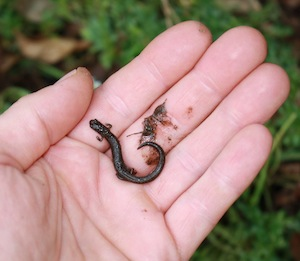

title: Using RDFa to Annotate Images
author: Alex Miłowski
published: 2012-05-24T09:17:12.327-07:00
updated: 2012-05-24T09:17:12.327-07:00
keywords:
- rdfa
- javascript
artifacts:
- kind: image/jpeg
  location: California-Slender-Salamander.jpg
content: |

   # Using RDFa to Annotate Images

   ### The Idea

   We'll annotate images using [RDFa Lite 1.1](http://www.w3.org/TR/rdfa-lite/) and generate the image annotations and semantics on the fly.  As a result, the annotations are part of the document content and can be indexed and processed by search engines.


   ### A Working Example

   The image:

   

   The annotation:

   <div class="annotation" resource="California-Slender-Salamander.jpg">
                       <div property="annotation" typeof="box"> Position: <span property="x">84</span>,<span property="y">114</span> Size: <span property="width">90</span> x <span property="height">75</span> Line Color: <span property="line-color">rgb(255,255,0)</span> Stroke : <span property="line-width">2</span> Description: <span property="description">California Slender Salamander</span> Link: <a href="http://en.wikipedia.org/wiki/California_slender_salamander" property="link"></a>
                       </div>
                   </div>

   How to try the example:

     1. If you mouse over the yellow box, you'll see a tool-tip.
     1. Clicking on the box will open the Wikipedia page for the Salamander.

   None of these semantics (or the yellow box) are in the original page or image. They are just described in the annotation markup above via RDFa. The page is made self-aware by using a library to access the page's own RDFa annotations--some of which could be content hidden from view.


   ### How to Add Annotations

     * First add a `typeof` attribute to an image that is annotated:

   ```HTML

       

   ```

     * Next, somewhere in the document, add an annotation. The above example looks like:

   ```HTML

       <div resource="California-Slender-Salamander.jpg">
           <div property="annotation" typeof="box">
               Position: <span property="x">84</span>,<span property="y">114</span>
               Size: <span property="width">90</span> x <span property="height">75</span>
               Line Color: <span property="line-color">rgb(255,255,0)</span>
               Stroke : <span property="line-width">2</span>
               Description: <span property="description">California Slender Salamander</span>
               Link: <a property="link"
                        href="http://en.wikipedia.org/wiki/California_slender_salamander"/>
           </div>
       </div>

   ```
   The annotation identifies the image by using the `resource`  attribute with a value of the URI of the image.  Contained within that parent element can be any number of annotations as long as the are associated with the `annotation` property relation.

   Note that the annotation can be hidden from view by CSS or just be placed in some part of the document's visible content.


     * Include the `[RDFa.js](http://code.google.com/p/green-turtle/) ` JavaScript to enable the RDFa API.


     * Include the `[image-annotations.js](/resources/ex/image-annotations.js) ` to invoke the  `ImageAnnotator` actor.  This script eventually calls:

   ```

       var imageAnnotator = new ImageAnnotator();
       imageAnnotator.process(document);

   ```


   ### How It Works

   The `ImageAnnotator` JavaScript uses the [RDFa API](http://www.w3.org/TR/rdfa-api/) and queries for annotated images by type to retrieve the `img` elements:

   ```

       var targets = document.getElementsByType("http://www.milowski.com/O/annotated");

   ```
   This returns an array of elements that have been typed via a `typeof`  attribute. Each typed element image element generates a subject of the URI of the image and each subject has a set of associated annotations in the RDFa data.

   The annotation associates itself with the image resource by using the  `resource` attribute. The result is a triple like:

   ```

       <California-Slender-Salamander.jpg> <http://www.milowski.com/O/annotation> <_:1>

   ```
   where the `_:1` is generally a blank node generated by the RDFa processor.

   In the code, the blank node URI is used to get an object called a projection that holds the actual annotation data. This process looks like:

   ```

       var annotations = document.data.getValues(
          targets[0].subject,"http://www.milowski.com/O/annotation");
   ```
   ```

       for (var i=0; i<annotations.length; i++) {
          var annotation = document.data.getProjection(annotations[i]);
          var type = annotation.get("rdf:type");
          if (type=="http://www.milowski.com/O/box") {
             var x = parseInt(annotation.get("http://www.milowski.com/O/x"));
             var y = parseInt(annotation.get("http://www.milowski.com/O/y"));
             ...
          }
       }

   ```
   Notice how the annotation properties are available from the projection and used to construct a type-specific annotation.
