[GQL ISO/IEC 39075:2024](https://www.iso.org/standard/76120.html) is a new database query language for property graphs that was recently 
published (April, 2024) by *ISO/IEC JTC 1/SC 32/WG 3* -- the same committee that 
publishes and maintains the SQL query language standards. The scope of GQL is to provide a
language for storing and querying [Property Graph](https://en.wikipedia.org/wiki/Property_graphs) structured data.

A property graph can be described as a directed multigraph where the nodes and edges may have:

 * labels - a set of "type names" associated with the target
 * properties - a set of name/value pairs

A simple way to conceptualize a property graph is with an [entity-relationship model](https://en.wikipedia.org/wiki/Entity–relationship_model)
but with the addition of *attributes for relations*. For example, a very simple graph of movies, actors, and genres might start with
an ER diagram as follows:


## Querying property graphs

Property graphs are not new and there are many graph databases that provide query languages for property graphs (not exhaustive):

 * [Neo4j](https://neo4j.com)
 * [FalkorDB](https://www.falkordb.com) 
 * [TigerGraph](https://www.tigergraph.com)
 * [Memgraph](https://memgraph.com)
 * [RedisGraph](https://github.com/RedisGraph) (discontinued)

Many of these databases use a query language called [Cypher](https://en.wikipedia.org/wiki/Cypher_(query_language)) which has an [open source specification](https://opencypher.org).

From the above list, some of these companies participated in the development in GQL. As such, it shouldn't be a surprise that GQL resembles Cypher in many ways.
In fact, some Cypher queries are valid GQL queries.

So, what does a GQL query look like (apart from Cypher-like)?

## Moving from Cypher to GQL

You can read the [openCypher language specification](https://s3.amazonaws.com/artifacts.opencypher.org/openCypher9.pdf) which
contains many examples of queries and expressions you can use in Cypher. At the current time, you would be hard-pressed to find a similar
primer on GQL with examples. The standard is also long and focus on the query syntax and semantics and so it also does not contain examples.

I did not personally participate on the GQL standards, but I have been trying to track its progress and so after ISO published the
standard, I immediately purchase a copy (yes, that is how ISO works and, yes, I'm that much of a nerd). It is long and detailed specification and also not a casual read. After
working through many of the grammars, I went about developing a full parser in python that is in a very "alpha" state at the moment. 


Stay tuned while I work on a primer for GQL and towards releasing that parser
in the near future. Those two go together as I need a good conformance test suite. Unless one exists somewhere ... ISO?


I have been using my parser it to validate my forays writing hypothetical GQL queries. As such, I went through the openCypher 
specification and tried to translate the examples. Let's go through a few examples from the introduction.

### Example 1

> "Nodes with name "John" who have more than three "FRIEND" relations."



```cypher
MATCH (n {name: 'John'})-[:FRIEND]-(friend)
  WITH n, count(friend) AS friendsCount
  WHERE friendsCount > 3
  RETURN n, friendsCount
```


GQL doesn't have the `WITH` construct but does have `LET` and `FILTER` and so this becomes:


```ISOGQL
MATCH (n {name: 'John'})-[:FRIEND]-(friend)
  LET friendsCount = count(friend)
  FILTER friendsCount > 3
  RETURN n, friendsCount
```


But GQL has some optionality in the syntax and so this may also be:


```ISOGQL
MATCH (n {name: 'John'})-[:FRIEND]-(friend)
  LET friendsCount = count(friend)
  FILTER WHERE friendsCount > 3
  RETURN n, friendsCount
```



I'm still reading through the semantics and so it isn't clear whether `FILTER WHERE exp` is different from `FILTER exp`.


### Example 2

Another example for mutating the graph:


```Cypher
MATCH (n {name: 'John'})-[:FRIEND]-(friend)
  WITH n, count(friend) AS friendsCount
  SET n.friendsCount = friendsCount
  RETURN n.friendsCount
```



```ISOGQL
MATCH (n {name: 'John'})-[:FRIEND]-(friend)
  SET n.friendsCount = count(friend)
  RETURN n.friendsCount
```



I'm aggregating the friend count in the `SET` statement. I question whether the `LET` should be there to 
perform the aggregation outside the context of the `SET` even though I omitted it in the above. I will have to see as I dig deeper.



## Understanding linear statements

In the [published BNF](https://standards.iso.org/iso-iec/39075/ed-1/en/ISO_IEC_39075(en).bnf.txt), you'll see that the above GQL queries are broken down into different statements that are chained together. These
queries eventually end up being parsed as an `ambient linear query statement` and that is processed as a sequence of
`simple query statement` productions followed by at `primitive result statement`. 

So, the prior GQL examples turn into:

  1. match + let + filter + return statements
  2. match + set + return statements

And all of these statements are chained together by an implementing system.

```mermaid
---
title: ambient linear query statement
---
flowchart LR
  S[➡]
  E[➡]
  S --> simpleLinearQueryStatement
  S --> primitiveResultStatement
  simpleLinearQueryStatement --> primitiveResultStatement
  primitiveResultStatement --> E
  subgraph simpleLinearQueryStatement[simple linear query statement]
    simpleQueryStatement[simple query statement]
    simpleQueryStatement --> simpleQueryStatement
  end
  subgraph primitiveResultStatement[primitive result statement]
    returnStatement["return statement"]
  end
```

```mermaid
---
title: simple query statement
---
flowchart LR
  S[➡]
  E[➡]
  callQueryStatement[call query statement]
  S --> primitiveQueryStatement --> E
  S --> callQueryStatement  --> E
  subgraph primitiveQueryStatement[primitive query statement]
    direction LR
    S1[➡]
    E1[➡]
    matchStatement[match statement]
    letStatement[let statement]
    forStatement[for statement]
    filterStatement[filter statement]
    orderByPage[order by and page statement]
    S1 --> matchStatement --> E1
    S1 --> letStatement --> E1
    S1 --> forStatement --> E1
    S1 --> filterStatement --> E1
    S1 --> orderByPage --> E1
  end
```






## What's next?

With a working parser I can validate my syntactic assumptions of what is and is not GQL. The next steps are to map my
expected semantics to the actual semantics of the language. I understand how Cypher works and so how does that
translate to GQL? That requires a deeper understand of how results are built from statements and there is a specification for that!

Back to reading, ... but I am going to be back with more after I peel back the next 🧅 layer. 
