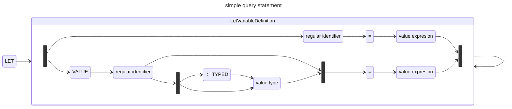

When trying to understand a new language, I always like to start with how variables are defined
and examine how scoping works with respect to variable usage. This helps with 
understanding the basics of how you can store values, use them in expressions, and where scope of use ends.
While this may seem simple, understanding how a language *implements* scoping rules isn't always simple.

## Execution context

At the center of evaluation in GQL is the "execution context" (§ 4.8)
that has:

 * a working record, which is a record,
 * a working table, which is a binding table,
 * an execution outcome

A statement in GQL may modify this context by setting the working table, working record, or the
execution outcome. During the execution of a construct, new "child contexts" may be
established, based on the current context, and used for nested evaluation. In the end, 
the "current working table" can be used to formulate the query result which is represented in 
the execution outcome.

For more on that, see "General Rules" in §14.10 &lt;primitive result statement> where you'll see
the conditions under which:

> The current execution outcome is set to a successful outcome with the current working table as its result.

The crucial point here is that the current "in scope" variable names are drawn from the fields of the working records and tables from
the current context in various ways.

## Calling procedures

Consider the following [GQL program shown](#inline-call) which is an inline procedure call (see § 15 "Procedure calling). An
inline procedure call is like a [closure](https://en.wikipedia.org/wiki/Closure_(computer_programming)) 
where the arguments to the procedure are a list of variables that must be available in the 
*incoming working record*. When that list is omitted completely, all the fields of the *incoming working record*
are available. Note that when an empty list of variables is specified (i.e., `()`), the effective
incoming variables are at empty sequence.


```ISOGQL
CALL (x, y) {
   VALUE z = x + y
   RETURN z
}
```


For a *procedure call statement* to evaluate, we need a complete context where `x` and `y` are defined so that
we can expect a successful outcome:


```ISOGQL
VALUE x = 40
VALUE y = 2
VALUE k = 12
CALL (x, y) {
   VALUE z = x + y
   RETURN z
}
```


Each statement in this program can change the context using incoming values for the
*working record* and *working table* to produce outgoing working records and table. 
For this query, the context is transformed as follows:

|Level | Statement | Incoming  | Outgoing | 
|---|-----------|----------|----------|
| 1 |```VALUE x = 40```| record: unit<br>table: unit | record: `x=40`<br>unit |
| 1 |```VALUE y = 2```| record: `x=40`<br>table: unit | record: `x=40, y=2`<br>unit |
| 1 |```VALUE k = 12```| record: `x=40, y=2`<br>unit | record: `x=40, y=2, k=12`<br>unit |
| 1 |```CALL (x,y) { ... }```| record: `x=40, y=2, k=12`<br>table: unit | record: `x=40, y=2, k=12`<br>table: 1: z=42 |
| 1.1 |```(x,y) { ... }```| record: `x=40, y=2`<br>table: unit | record: `x=40, y=2`<br>table: 1: z=42 |
| 1.1.1 |```{ VALUE z = x + y RETURN z }```| record: `x=40, y=2`<br>table: unit  | record: `x=40, y=2`<br>table: 1: z=42 |
| 1.1.1 |```VALUE z = x + y```| record: `x=40, y=2`<br>table: unit  | record: `x=40, y=2, z=42`<br>table: unit  |
| 1.1.1 |```RETURN z```| record: `x=40, y=2, z=42`<br>table: unit  | record: `x=40, y=2, z=42`<br>table: 1: z=42  |

In the above table, I have attempted to outline how the execution context
changes when executing the [GQL program with values for `x` and `y`](#inline-call-context). Each
of the columns have these definitions:

 * The "level" column shows the execution context as it is changed for "child" constructs. 
 * The "statement" column is the portion of the query being evaluated.
 * The "incoming" is the record and table of context coming into the expression
 * The "outgoing" is the record and table of the context resulting from the expression evaluation.
  

The evaluation can be explained as follows:

 * A *value variable definition* (§ 10.3) (in rows 1-3 and 7) adds a single variable to the incoming working record of the current context. It is an error if the name is already in the working record.
 * The *call procedure statement* (§ 15.1) (in row 4) invokes a procedure call and the outgoing context is the incoming working table amended with the outgoing working table of the procedure called.
 * The *inline procedure call* (§ 15.2) (in row 5) changes the incoming record to be those variables lists in the *binding variables* listed (e.g., `(x, y)`).
 * The *nested procedure specification* (§ 9.1) / *procedure body* (§ 9.2) (in row 6) create a new execution context whose working record contain the results of the *value variable definition*. Otherwise, the working record remains unchanged. In this case, the definition of `z` causes a new child execution context.  Also, the outgoing declared type of the *procedure body* is the declared type of the last statement in the procedure.
 * The *value variable definition* (§ 10.3) (in row 7) only declares `z` in the context. In this case, it is a new child context. The result is that `z` won't be available outside the *nested procedure specification*.
 * The *return statement* (§ 14.11) changes the working table of the current execution context. This establishes the declared type of the *procedure body* which will be used to merge the results into the calling context.


While I believe this is correct, I may have missed some nuance. I am working though how binding tables are transformed and how values interact with them.


The result of this query is:

 * The working record: `x=40, y=2, k=12`
 * The working table: `1: z=42`
 * The outcome: successful, unit


The overall query didn't return anything and so the result is successful but empty.


## Let statements

If a *value variable definition* adds a field to the *working record*, then what does a *let statement* (§ 14.7) do? The short
answer is that a let statement changes the *working table*. Consider the example [query with let statement](#example-let)
where we bind the variable


```ISOGQL
MATCH (n {name: 'John'})-[:FRIEND]-(friend)
  LET friendsCount = count(friend)
  RETURN n, friendsCount
```


The first thing to note is that every instance of `variable = expression` is a shorthand for 
`VALUE variable = expression`. You can see this in the grammar below:



The semantics of a *let statement* first transforms these shorthands into *value variable definitions*:

```
LET friendsCount = count(friend) → LET VALUE friendsCount = count(friend)
```

The second transformation is from the *let statement* into a *call procedure statement* with an *inline procedure call*
where the *variable scope clause* (§ 15.2) is a list of all the *binding variable references* used in the right-hand side
of the *let variable definitions*:

```
LET VALUE friendsCount = count(friend) → CALL (friend) {
                                            VALUE friendsCount = count(friend)
                                            RETURN friendsCount
                                         }
```

The body of the procedure is a *value variable definition* for each *let variable definition*. The procedure ends with
a *return statement* that enumerates the left-hand side of the *let variable definitions*.

The resulting query executed is shown in [query executed](#example-execution) where the *let statement* has been
replaced with *call procedure statement*. 


```ISOGQL
MATCH (n {name: 'John'})-[:FRIEND]-(friend)
  CALL (friend) {
    VALUE friendsCount = count(friend)
    RETURN friendsCount
  }
  RETURN n, friendsCount
```


When tracing through the execution contexts, you'll see how `friendsCount` is added to the binding table
via the *call procedure statement* that replaced the *let statement*. At the end, values in the context's working
table is used for the *result statement*.


I see a problem here with `friend` that I can't quite sort. The `friend` variable reference is to a node
from the *match statement*. So, that's in the binding table. The binding variable references are 
allowed to be the union of the field names of the working record and working table. Meanwhile, § 15.1 states
that the incoming working record's declared type is the incoming working record amended by the
declared type of the incoming working table - which is some sort of record union. But, it isn't
clear to me yet how the *call procedure statement* scopes references from the binding table nor
exactly how that amending works with the current working record used for variable scoping.



## Can variables refer to each other?

The short answer is "yes" but only in declaration order.  It is easy to see that this
should work:

```
VALUE x = 1
VALUE y = 2
VALUE z = x + y
```

And this should not:

```
VALUE z = x + y
VALUE x = 1
VALUE y = 2
```

For a let statement, there is a similar ordering requirement:

```
LET x = 1, y = 2, z = x + y
```

which becomes:

```
CALL {
   VALUE x = 1
   VALUE y = 2
   VALUE z = x + y
   RETURN x, y, z
}
```

Where the only difference between let and value bindings is whether the fields names are in the working record or working table.

## Concluding thoughts

There was a lot of background material to get to the conclusion of "expected semantics" for variable
binding and use. The distinction between the "working record" and "working table" is essential
to understand but has some hidden complexity. The challenge there is understanding how
simple value bindings are handled versus variables that refer to patterns of results (e.g., a
set of matching nodes) where their enumeration could be large; a topic for another post.

This is my first foray into how various expressions affect the context. There is more complexity that I need
to sort for myself in terms of how values are added to binding tables when you have fields whose value
space is a set of nodes from a match pattern. That is,
I need to have a deeper understanding of exactly how working tables are amended via joins or other operators.

Feedback and questions are always welcome!